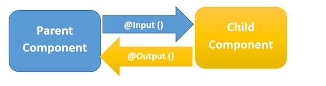
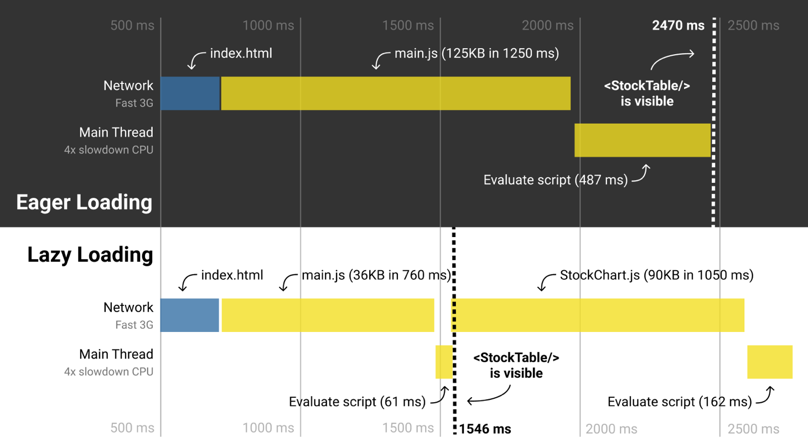

# Core Concepts to master any FrontEnd frameworks


Ngày nay, **Front-end web development** không chỉ giới hạn ở HTML, CSS và JavaScript. Nhu cầu trải nghiệm web của người dùng ngày một cao, điều đó đòi hỏi FE phải mở rộng thêm nhiều libraries, frameworks để đáp ứng được công nghệ mới và gia tăng UI/UX. Vì thế rất nhiều frameworks được ra đời, và danh sách này sẽ còn gia tăng và phát triển trong rất nhiều năm tới. Đi kèm với đó, rất nhiều cuộc tranh cãi về việc đâu là framework tốt nhất, đâu là framework được developers chọn nhiều nhất, và dĩ nhiên, chưa bao giờ có câu trả lời thoả đáng bởi vì mỗi frameworks đều có những ưu và nhược điểm khác nhau.

Như lịch sử đã chứng minh, **web development** là một lĩnh vực phát triển với tốc độ mạnh mẽ, bạn sẽ ngụp lặn trong thế giới web nếu như không chuẩn bị sẵn sàng để chuyển từ framework này sang framework khác. Việc tiếp cận framework mới thực sự sẽ rất dễ dàng khi bạn nắm vững một vài concept chính trong bài viết này, và bạn sẽ trở thành một FE developer được săn đón trong nhiều năm tới, bất kể bạn đang chọn framework nào.

## 1. Components

Component là khái niệm cơ bản nhất mà một FE developer phải nắm, nó là nền tảng của sự phát triển giao diện người dùng nhưng cũng là khái niệm quan trọng nhất thúc đẩy sự phát triển của **Frontend frameworks** hiện đại ngày nay. Nếu không thực sự hiểu về components, ứng dụng web của bạn có thể sẽ phình to rất nhanh.
### Vậy component là gì ?

Một component là 1 tổ hợp của các phần tử HTML đi kèm với markup (styling) và các script xoay quanh các phần tử đó. Tất cả các thành phần nhỏ nhất của web sẽ nhóm lại theo các tính năng tương ứng, và quy về component.

Lấy ví dụ: để show ra Todo list có 5 items, thì chúng ta sẽ phải xây dựng 2 components:


- Todo item: chứa giao diện của 1 item và các chức năng cần thiết như show content, edit & delete chính mình.
- Todo list: chứa 5 components Todo item và có chức năng show ra các items, phân trang nếu như có quá nhiều items,....

3 thứ tạo nên components là **Template**, **Styling**,  **Script**,và để có thể viết đc component thì FE developer phải nắm vững HTML, CSS, JS.

### Tại sao phải cần component ?

Nếu như ko có component Todo item, và clients thay đổi specs, không có tính năng edit item nữa, thì developer phải thực hiện xoá phần code liên quan đến việc edit **5 lần**. Điều này thực sự rất tốn thời gian so với việc chia component Todo Item và sử dụng lại, chỉ cần thay đổi content của component Todo Item **1 lần** là sẽ áp dụng cho tất cả items.

> Vì vậy bắt buộc phải chia component khi lập trình web ở bất cứ framework nào. Việc chia components giúp chúng ta có thể tái sử dụng, dễ dàng sửa đổi và mở rộng code. Code sẽ sạch sẽ và tường minh hơn rất nhiều khi components đc chia hợp lý.


## 2. Lifecycle Hooks

Mỗi component instance sẽ trải qua 1 loạt các sự kiện khi nó đang tạo ra. Đồng thời, nó cũng chạy các function được gọi là life cycle hooks, cho phép người dùng có cơ hội thêm code ở các giai đoạn cụ thể.

Cũng giống như tất cả lifecycle khác, lifecycle hooks của 1 component bao gồm các sự kiện quan trọng diễn ra trong quá trình sống của component đó, lấy ví dụ, component được sinh ra (init), component setup data, compile template, mount instance đó vào DOM (mounted), và update DOM khi data thay đổi, và cuối cùng là component mất đi (unmounted).

Mỗi Framework sẽ có cách tiếp cận lifecycle hooks khác nhau, nên FE developer cần phải nắm được **Lifecycle Diagram** của từng framework.

Để dễ hiểu hơn, mình sẽ đưa ra 1 bài toán cụ thể, bài toán yêu cầu *chỉ gọi API get về danh sách news khi vừa mở ra page News* - page News được thiết kế là 1 component và API sẽ phải gọi khi nó init xong, dựa trên Lifecycle Diagram của từng framework chúng ta sẽ đặt code gọi API lần lượt ở trong các hooks `ngOnInit` (Angular), `componentDidMount` (Reactjs), `mounted` (Vuejs),....


## 3. Data Binding

Mỗi framework sẽ có 1 cơ chế data binding khác nhau, nhưng nhìn chung là chỉ cần nắm được syntax của những mục bên dưới. 

- **Text interpolation - show value của variables trên UI** 

Angular, Vuejs: sử dụng "Mustache" syntax (double curly braces)

```vue
<span>Message: {{ msg }}</span>
```

React: sử dụng special syntax của JSX (curly braces)

```react
<span>Message: { msg }</span>
```

- **Attribute Bindings - thao tác đến attribute của elements**

  Để input value cho attribute thì mỗi framework đều có sử dụng 1 cách khác nhau, hãy xem ví dụ bên dưới:

  Angular - sử dụng `[]` trên attribute

  ```tsx
  <a [href]="url">...</a>
  ```

  Vuejs - sử dụng `:` trên attribute
  ```vue
  <a :href="url">...</a>
  ```

  Reactjs - sử dụng `curly braces {}` trên variable

  ```react
  <a href={url}>...</a>
  ```

- **Class & Style Binding - thao tác đến class và inline style của elements**

​		`class` và `style` là attributes đặc biệt của element, một số frameworks support cách binding với Object, Array, sẽ tạo ra code tường minh hơn.


## 4. Components interaction

Sự tương tác giữa các component có liên hệ với nhau là rất cần thiết trong modern frameworks. 


Các component lồng ghép nhau tạo nên component tree, và mỗi node trong tree sẽ là 1 component. node này có thể là parent của node kia, và cũng có thể là 1 child của 1 node khác. Mối quan hệ chủ yếu là **parent - child**. Nếu thực hiện tương tác giữa 2 node cách quá xa nhau có thể rơi vào case `props drilling`.



Các cách để interact giữa parent & child mà frameworks thường hay sử dụng:

- **Truyền data từ parent vào child:** truyền value vào cho child sử dụng.
- **Parent lắng nghe events từ child:** tạo function và truyền vào cho child, child sẽ execute function và gửi kèm data ra cho parent khi một event xác định diễn ra. 
- **Parent truy cập trực tiếp đến child:** parent có thể truy cập đến tất cả variable và function ở bên trong child, thậm chí là thay đổi value của variable, hoặc thực thi function của child.


## 5. Routing

Client-side routing là chìa khóa của SPA frameworks mà chúng ta thấy ngày nay. Rất dễ để implement nhưng cần nắm vững `routing hierarchy`.
Đầu tiên hãy tìm hiểu về **dynamic routing** . Trở lại với ví dụ todos ở mục 1, trang list ra tất cả todos sẽ có route `/todos`, khi user nhấp vào 1 todo, họ sẽ được đưa đến một trang dành riêng cho todo đó (Todo Detail), route của trang này sẽ phải có dạng ` /todos/:id`. `id` là 1 dynamic variable, dù `id=1`, `id=2` cũng sẽ show ra trang Todo Detail. 

Tiếp theo, hãy tìm hiểu về cách để **nested routing** - trong 1 route sẽ có nhiều routes con phụ thuộc, nó cho phép thay đổi các fragment cụ thể của view dựa trên current route.

- Ví dụ: trên trang user profile, sẽ hiển thị nhiều tab (ví dụ: Profile, Account) để điều hướng qua user info. Bằng cách nhấp vào các tab này, URL trong trình duyệt sẽ thay đổi, nhưng thay vì thay thế toàn bộ trang, chỉ nội dung của tab được thay thế.

Cuối cùng, hãy luôn lưu ý đến việc sử dụng **lazy loading** cho route, nó sẽ giúp cho webapp nhẹ hơn khi chỉ cần load những đoạn code liên quan đến route đang mở, thay vì load hết tất cả code ngay lần đầu tiên truy cập đến trang web. 




Theo diagram, có thể thấy, StockTable được render nhanh hơn với 1546ms của lazy loading so sánh với 2470ms của eager loading.


## 6. State Management

